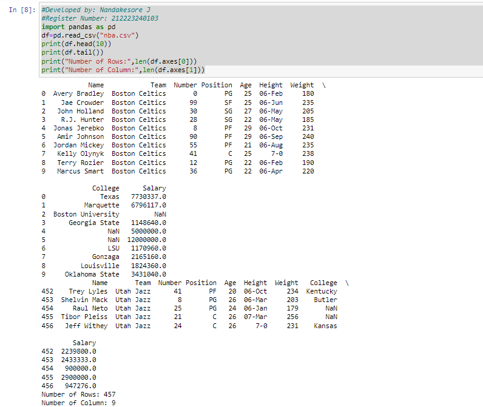

# Read-from-CSV

## AIM:
To write a python program for reading the csv file content
## ALGORITHM:

### Step 1:
Load the CSV into a DataFrame.

### Step 2:
Print the number of contents to be displayed using df.head().

### Step 3:
The number of rows returned is defined in Pandas option settings.

### Step 4:
Check your system's maximum column with the pd.options.display.max_column statement.

### Step 5:
Increase the maximum number of rows to display the entire DataFrame.

## PROGRAM:
```
#Developed by: Nandakesore J
#Register Number: 212223240103
import pandas as pd
df=pd.read_csv("nba.csv")
print(df.head(10))
print(df.tail())
print("Number of Rows:",len(df.axes[0]))
print("Number of Column:",len(df.axes[1]))
```
## OUTPUT:

## RESULT:
Thus the give problem to read CSV file is implemented and executed successfully.
